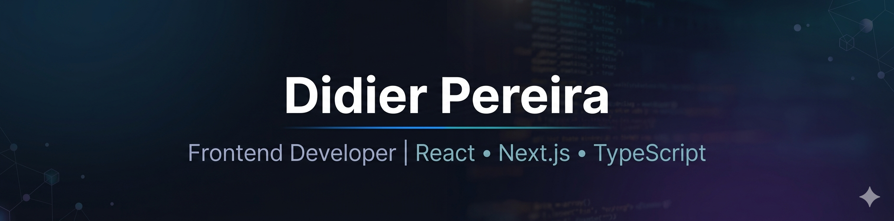

<!-- Banner Profesional (Crea tu banner en Canva y súbelo a assets/banner.png) -->

<h1 align="center">👋 Hola, soy Didier Pereira</h1>

<h3 align="center">
  💻 Desarrollador Frontend | React • Next.js • TypeScript
</h3>

  

---

##  **Sobre mí**

Soy un **Desarrollador Frontend** con **más de 2 años de experiencia** construyendo aplicaciones web escalables y de alto rendimiento para los sectores **fintech y SaaS**. Me especializo en **arquitecturas frontend modulares**, manejo de estado complejo y en ofrecer experiencias de usuario fluidas en entornos de alta exigencia.

- 🚀 **Actualmente:** Profundizando en Next.js, TypeScript y Diseño de Sistemas a través de proyectos avanzados.
- 🌱 **Aprendiendo:** Node.js, Estrategias de Testing y Arquitectura de Software.
- 🎯 **Abierto a:** Roles frontend remotos con **empresas de producto en EE. UU.** en dominios fintech, SaaS o de cumplimiento normativo.
- 📬 **Contacto:** [didierernestopereiragarcia@gmail.com](mailto:didierernestopereiragarcia@gmail.com)

 

## 🧰 **Stack Tecnológico**

#### **Frontend Core**

#### **Manejo de Estado y Obtención de Datos**

#### **Backend y Bases de Datos (Conocimientos)**

#### **Herramientas y Plataformas**

 

## 📌 **Proyectos Destacados**

| Proyecto | Descripción | Stack | Enlaces |
| :--- | :--- | :--- | :--- |
| **🎛️ Dashboard RBAC** | Simulación de un panel de administración complejo con Control de Acceso Basado en Roles (RBAC), gráficos interactivos y tablas de datos. | `Next.js`, `TypeScript`, `Redux Toolkit`, `Recharts` | `[Repo]` `[Demo]` |
| **💼 Portafolio 2025** | Mi sitio web personal, diseñado para ser rápido, accesible y mostrar mi trabajo de forma profesional. | `Next.js 15`, `TypeScript`, `Tailwind CSS`, `Framer Motion` | `[Repo]` `[Demo]` |
| **🛒 E-commerce Henry** | Plataforma de comercio electrónico full-stack desarrollada como proyecto final, con catálogo de productos, carrito y flujo de pago. | `React`, `Redux`, `Node.js`, `Express`, `PostgreSQL` | `[Repo]` `[Demo]` |

 

## ⚙️ **Estadísticas de GitHub**

  

 

## 🤝 **Conecta Conmigo**

  
  
  

 

  

